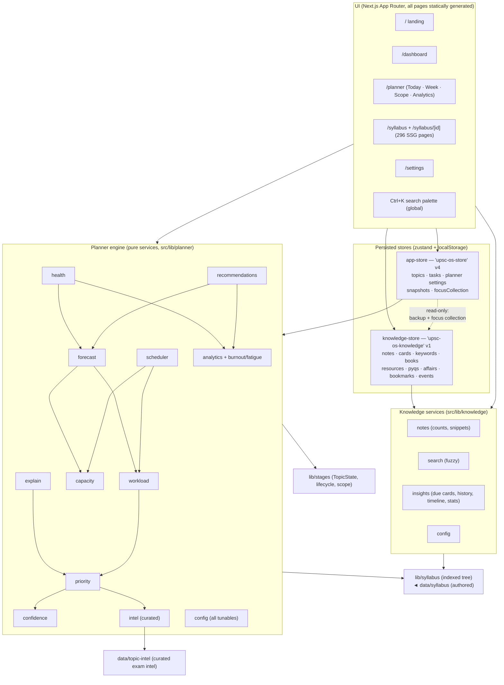
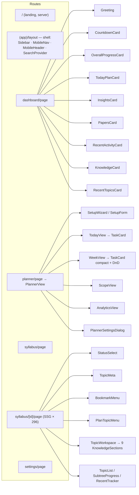
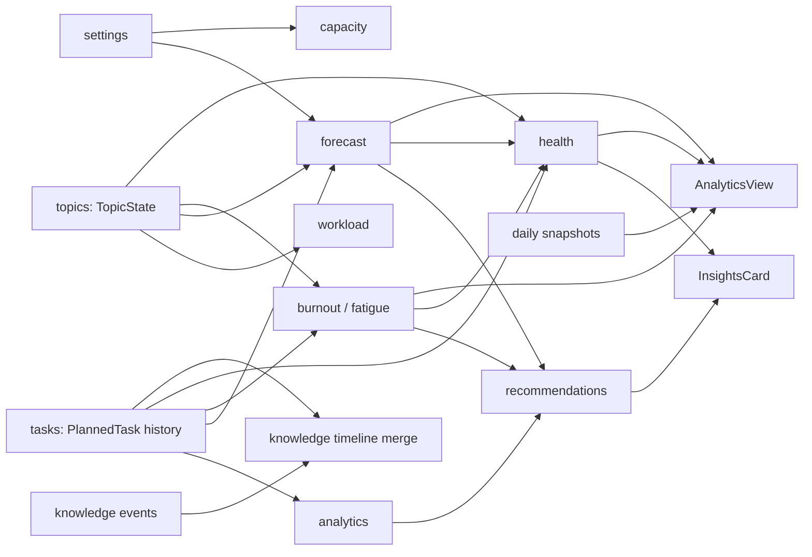
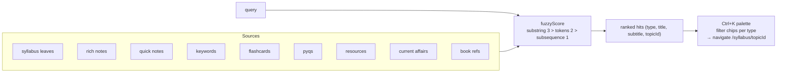
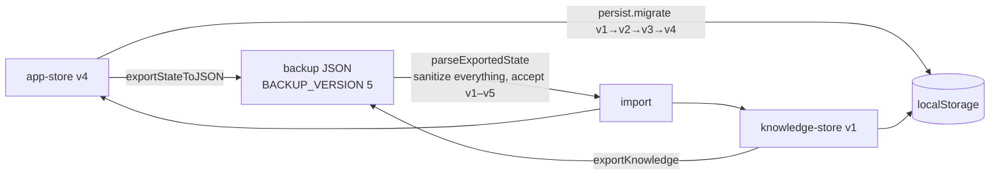

# SYSTEM_ARCHITECTURE.md

> The complete architecture of UPSC OS as implemented (2026-07-05).
> All diagrams are Mermaid. Nothing here is aspirational — every box exists in
> the codebase today.

## 1. Bird's-eye view



Dependency direction is strict: components → stores → services → data.
Services never import stores. knowledge-store never imports app-store.

## 2. Route & component map



## 3. The scheduling pipeline (one replan)

```mermaid
sequenceDiagram
    participant UI as PlannerView / actions
    participant Store as app-store.regenerate
    participant An as analytics.fatigueIndicator
    participant KS as knowledge-store (read)
    participant Sch as scheduler.generateSchedule
    participant Wk as workload
    participant Pr as priority/confidence/intel

    UI->>Store: regeneratePlan()
    Store->>Store: overdue pending → "missed" (+ behaviour counters)
    Store->>Store: drop pending auto tasks; keep pinned (scope-aware)
    Store->>An: fatigue from REAL history (never planned load)
    An-->>Store: loadFactor (burnoutSensitivity damping)
    Store->>KS: focusCollectionId → topic id set (fresh study only)
    Store->>Sch: settings, topics, pinned, usedToday, loadFactor, filter
    Sch->>Wk: buildRevisionQueue (included topics, due ≤ horizon)
    Sch->>Wk: buildWorkPool (included ∩ filter, minus pinned minutes)
    Wk->>Pr: priorityScore per topic (with reasons)
    loop each day in 14-day horizon
        Sch->>Sch: skip recovery/vacation; capacity × factors
        Sch->>Sch: 1) due revisions (≤60% cap) 2) continuity 3) rotation fill\n(hard spacing, maxHard/day, pick sweep ≤40)
    end
    Sch-->>Store: auto PlannedTasks
    Store->>Store: write daily snapshot (burnout, health, remaining, backlog)
    Store-->>UI: new state → all widgets re-derive
```

## 4. Data flow for derived intelligence



Nothing in this graph is stored except the inputs (topics, tasks, events,
settings) and the daily snapshot; every arrow is a pure function evaluated in
`useMemo` on render.

## 5. Search architecture



## 6. Backup & persistence



## 7. Subsystem inventory (file ↔ responsibility)

| Subsystem | Files | Responsibility |
|---|---|---|
| Syllabus | `data/syllabus/*`, `lib/syllabus.ts` | Authored tree → indexed API (ids, breadcrumbs, leaf counts) built once at module load |
| Lifecycle | `lib/stages.ts` | StudyStage ladder + weights, TopicState (+plan scope), priorities meta, cached default-merge |
| Progress | `lib/progress.ts` | Weighted roll-ups per subtree |
| Exam intel | `data/topic-intel.ts`, `lib/planner/intel.ts` | Curated priorities/difficulty/time; cascading resolution user→topic→ancestors→config |
| Capacity | `lib/planner/capacity.ts` | Day/weekly minutes, sessions, slots, vacations, weekend & aggressiveness factors |
| Workload | `lib/planner/workload.ts` | Estimates, remaining minutes, revision minutes, pools & queues (scope-aware) |
| Priority | `lib/planner/priority.ts` + `confidence.ts` | Dynamic score with reasons; effective-confidence decay model |
| Scheduler | `lib/planner/scheduler.ts` | The day-fill pipeline (revisions → continuity → rotation) |
| Forecast | `lib/planner/forecast.ts` | Workload vs capacity vs observed pace; probabilities; CI |
| Analytics | `lib/planner/analytics.ts` | Streaks, completion %, distributions, burnout + fatigue indicators |
| Recommendations | `lib/planner/recommendations.ts` | Rule set with mandatory WHY |
| Health | `lib/planner/health.ts` | 7-component weighted score |
| Explain | `lib/planner/explain.ts` | Per-task reasons + mission reasoning (reconstructed, not stored) |
| Knowledge | `lib/knowledge/*`, `store/knowledge-store.ts` | Entities, CRUD, review logic, timeline, sanitization, search, insights |
| Stores | `store/app-store.ts`, `store/knowledge-store.ts` | Persistence, actions, migrations, backup |
| Shell/UI | `components/**` | Presentation only; business logic lives in lib/ |

## 8. Rendering & performance model

- All 303 pages are statically generated (SSG); interactivity is client-side.
- Client components reading persisted state gate on `useMounted()` to avoid
  hydration mismatches (SSR renders defaults).
- Expensive derivations (`forecast`, `health`, `recommendations`, search hits,
  scope counts) are wrapped in `useMemo` keyed on store slices; store slices
  are stable references (immutable updates + `getTopicState` WeakMap cache).
- The scheduler runs only on explicit replan triggers, never per-render.
- Timeline events capped (1500) and snapshots pruned (60 days) to bound
  localStorage growth; a usage meter lives in Settings.
